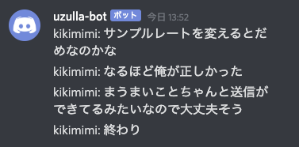

# キキミミ

入力音声を自動テキスト起こしして、Discordにメッセージを送信します。



Hachioji.pm #79 のLT発表のためにつくった、コンセプト実証プログラムです。

## 背景

Covid-19にともなうリアルイベントの自粛によりコミュニティはオンラインに移行をはじめたが、現在のところオンラインの通話（テレカン、Zoom飲み会）は人数が増えると（具体的には４人以上）破綻しやすい。（現実では、実テーブルが分かれることでクラスタ化されて解決されるし、声をでかくすれば解決する）

しかし、そうはいっても３〜４人が上限ではいささかコミュニティとしてさびしいので、様々なツールが登場している。たとえばRemoなどはバーチャルなテーブルを用意し、テーブル間を簡単に移動できる（ということになっている）。Discordでも、音声chをふやせばその分仮想的な机をふやすことができる。

しかしながら、現実ではテーブルを移動したり、向こうの方から自分が呼ばれるみたいなことはあり、それが実現できていないし、様子のみえないchに飛び込むのは非常な心理的ストレスがかかる。よってテーブルから逃げるのもなかなかむずかしい。

ということで、聞き耳をどうやってたてるか？というのが課題だと考えており、このようなツールがあれば、「喋っている内容を」ほかの人が喋りながら「目で」聞き耳をたてることができるので、複数チャンネルでのオンライン飲み会で、テーブルを渡り歩くことができるのではないか？全体の雰囲気を感じられるのではないか？というPoCになります。

## 展望（？）

- 名前や自分の得意な話題をキーワードにして、Mentionなど
- もりあがりの可視化（音圧でも取るか？ｗ）
- テキストはだるいし、Zoomとかにボットとしてテレカン参加させて、「ほかのchの様子です」とかいってアバターにテキスト表示とかさせたい。


## 要素技術

- google speech to text
- node.js
- discord.js
- SoX

### なぜ、GCP Speech to text をつかったのか？AWSではダメなのか？

一番コードが楽にかけたからです。（思いつき翌日、WebStormインストールする所のから２時間でつくったので）

## つかいものになるの？つかってみたいんだけど？

がんばって！

## setup

### install sox

オーディオを扱うプログラム

- [http://sox.sourceforge.net/](http://sox.sourceforge.net/)

```
$ brew install sox
```

### Enable speech to text API and get google Credential

GCPに登録して、APIを有効化して、Credentialを取る。

- [https://console.cloud.google.com/apis/api/speech.googleapis.com/overview](https://console.cloud.google.com/apis/api/speech.googleapis.com/overview)
- [https://console.cloud.google.com/apis/api/speech.googleapis.com/credentials](https://console.cloud.google.com/apis/api/speech.googleapis.com/credentials?project)

CredentialのJSONをゲットして、それを適当に配置し、環境変数で指定。

```
$ export GOOGLE_APPLICATION_CREDENTIALS="project-some.json"
```

うまくいけば、`node test-speach-to-text.js`で音声認識のテストができる。

### get webhook url(id&token) 

`.env.sample`を`.env`にコピーして修正。

Discordでchをつくり、chのPrefからウェブフックを作成でURLを取得。

> urlからidとtokenをぬきだす方法は`.env.sample`に記述されています

うまくいけば、`node test-discord-post.js`でポストができる

## 実行

前述２つが動くならば、実行できるはず。

```
$ node kikimimi.js
#C-Cで終了
```

> Speech to Text APIの仕様で、305秒でとまります。これはストリームを作り直せばいいが、まだやっていない。

## 備考、あるいは今後の課題

### 「Discordの音」をどうやって(soxに)取り込むか。

- SoundFlower [website](https://github.com/mattingalls/Soundflower) (安全なSFはどこにあるんや！)
- Loopback [website](https://rogueamoeba.com/loopback/)

などで、Discordの音を仮想オーディオインプットにまわして取り込むしかなさそう。自分はLoopbackで動作することを確認した。

### 音声を認識しない、反応しない。

ざっくりいって、音が悪いと認識しない。イヤフォンマイクでよいので、PC本体のマイクはやめよう

Macだと、コンパネから適切に音声入力インターフェイスが選択されているかしらべよう


### ラグい（あるいはめちゃめちゃ時間がたってから反応する）

Speech to text APIは、ある程度の喋りの「途切れ」をもって翻訳している気がするので、勢いがありすぎるとむずそう。

パラメーターで工夫することはできそうだが、これを書いている当日、GCPのドキュメントがあらゆるところでエラーだしていて読めない…辛い…。


### ch毎に 1 kikimimiいるの…？

「今の所は」必要ですね…。Loopbackをつかえば色々音のつなぎ込みはできるだろうが、SoXがあんまり融通きかないきがする、Soxのプロに「どのインターフェイスをつかうか選択する」方法をおしえてもらいたい。あるいはLinuxとかならインターフェイス指定できそう。

というか、こういうのをどこかが実装するのは時間の問題だと思う。


